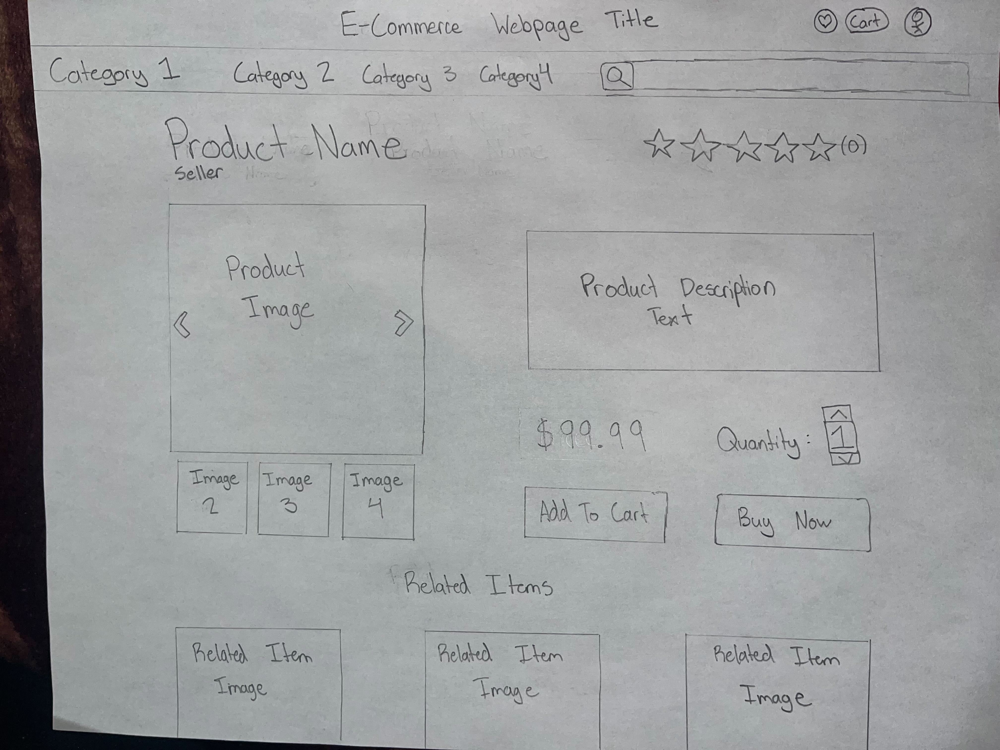
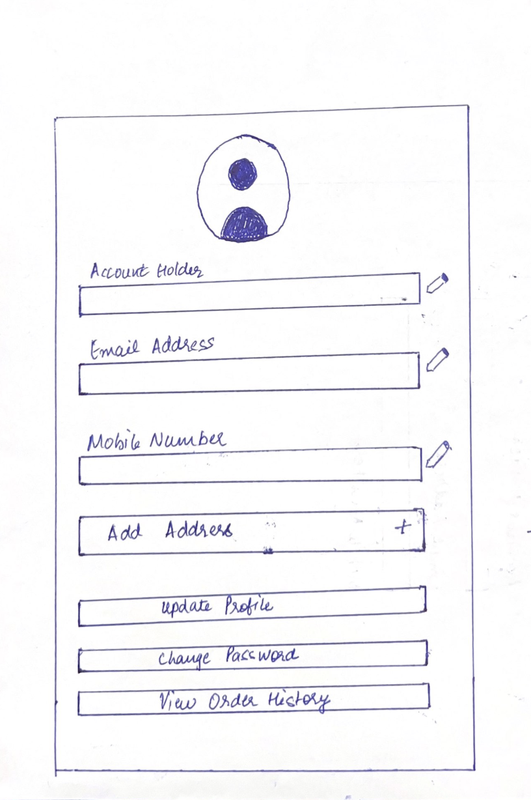

# About Our E-Commerce App

Discover the joy of online shopping with our user-friendly E-Commerce app. Browse products, add them to your wishlist or shopping cart, share them with your friends, breeze through checkout, and let admins effortlessly manage the store. Welcome to our app where shopping is a delightful enchantment for all.

## **Project Task Requirements**:

1.  **Minimal Requirements**

    a. A dashboard with a search bar with product filters ✅

    b. View selected product details ✅

    c. Add product to shopping cart ✅

    d. Products checkout page ✅

    e. User Authentication with password assistance ✅

2.  **Standard Requirements**

    a. User Account page ✅

    b. View past orders ✅

    c. Add products to wishlists ✅

    d. An option to share products with friends ✅

    e. Add product ratings ✅

    f. Email notifications on product purchase ✅

3.  **Stretch Requirements**

    a. Show user's recently viewed products ❌

    b. Add reviews to a product/see past reviews ✅

    c. An option to return an order ✅

    d. Functionality to create seller/admin accounts ✅

    f. Allow seller/admin to post, delete, and update products ✅

## Tech Stack

1. **HTML, CSS, JS**

- HTML establishes a web page's structure by logically segmenting the information of our app into individual elements which enhances Accessibility and Search Engine Optimization.
- With the help of Media queries, CSS is in charge of styling HTML elements on a webpage and improving the user experience of our app by making it responsive.
- JavaScript provided powerful tools for managing how the Document Object Model should respond to various user-driven events.

2. **React & Redux**
- React and Redux are used throughout this project to create a robust and maintainable frontend architecture. Compared to standard HTML, our project utilized React components, which efficiently manage the application's UI rendering, promoting code reusability and readability.
- Redux is integrated into our project to manage a global state, ensuring seamless data flow and facilitating efficient state management across components.

3. **Node & Express**
- This project utilized Node.js and Express.js to enhance the backend architecture of our web application. Node.js ensures our server can handle multiple connections simultaneously, making our project scalable and high performance.

- Express.js serves as our application framework, it provides our server-side code a clear and organized structure for routing and request handling.

4. **MongoDB**
- Databases are designed for long term, permanent storage of data and we use the MongoDB database to store our user, 
  products and orders information.With its scalable schema design, this project is able to maintain a well-defined 
  data structure while optimizing query performance. 
- With MongoDB, it allows for more flexible information storage as some fields are not always necessary in a 
 document and makes for easy changes in schema if needed.
- Moreover, it allows for multiple servers to be connected to it, which creates high availability and while we do 
  not yet have multiple servers connected to our application, it can be an improvement we would want to implement in 
  the future for the application.

5. **Builds and Deployment**

- Render is used as our deployment system as it provides an easy deployment process for any application by 
  connecting the Github repository containing the application and automatically re-deploys the application with any 
  subsequent updates.
- It also allows for secret files such as database login information so that this information does not need to be stored in another file in the repository and Render has advanced DDoS protection powered by Cloudflare.

## Above and Beyond Functionality

1. **Firebase's seamless user authentication and password reset feature**

- Developed a seamless user authentication system using the Firebase API that provided secure login and allows users to reset their passwords if they forgot them.
- A new user can open an account, and an existing user can edit their profile.
- We also provide a logout option, and users can use the application with limited access as a guest.

2. **Order Confirmation Emails using Sendgrid API**

- Users receive order confirmation emails via Sendgrid API that include complete order details and delivery addresses.

3. **Use of various React Libraries**

- Our app's user-friendly interface was made possible by the use of react libraries like react-share, react-toastify, and react-image-gallery across multiple places and the entire website is totally responsive, enabling seamless user interaction and viewing.
- React-Toastify is used to display toast notifications for every user action, such as logging in or out, posting a review, returning an order, etc. Notifications for both errors and successes are displayed.
- React-image-gallery is used to create sliders for better image displays across different places in our website, such as the main page and the product details page
- React-credit-cards is used to create a credit card display that highlights the information when entered during the checkout process. 

4. **Share products on Social Media**

- React share is used on the product page to give customers the opportunity to email and share their favorite products on Facebook.

5. **Google Places Autocomplete API**
  - This application uses the google places autocomplete API in pages like checkout and user profile. With the use 
    of places autocomplete, this app can detect user input and generate address recommendations accordingly.
  - Combobox library is used along with google places autocomplete to display the address search bar along with the 
    recommendations dropdown.

## Next Steps

We have successfully fulfilled nearly all project requirements, with the exception of the 'Show Recently Viewed Products' feature, which remains pending. Completing this goal would further enhance the app's overall functionality.

During our discussions, we also explored additional potential features to enrich the shopping site's capabilities. These exciting prospects can add depth and sophistication to our platform, including

- Multi-language support for broader accessibility
- Implementing an advanced product recommendation algorithm personalized to each user
- Supporting different colors and sizes for each product
- Allowing actual payments and order tracking system
- Introducing user roles to create separate pages exclusively accessible to sellers and buyers

## List of Contributions

Arshdeep Jassi

- Product Page
    - Designed and implemented the product page, which includes fetching product information such as images and price, past reviews that other users have given, the ability to add your review once you've purchased the item, and a view of related items that the user could also be interested in. 
- Wishlist Page
    - Allowed users to add items to their wishlist from its product page and created a new page where users can view wishlisted products, remove products from their wishlist, or add items from their wishlist to their cart.

Danielle Chen

- Front page
    - Designed Product Card
    - Made up images for sliders
    - Fetch and display products
- Dashboard page
    - Implemented Search bar
    - Implemented product filters
- Collected all product data to database
- Modified router links

Elsie Lee - Shopping Cart/Order History

- On the shopping cart page, relevant product information is displayed; this includes: the product image, name, description and price depending on the quantity selected while Redux is used as temporary persistent data storage to keep the products in cart only during that session of login.
- On the order history page, it contains the same product information as the shopping cart, but also contains the name of who will receive the package and their shipping address if the user hovers over the receiver name. Redux is used to keep a temporary store and also to maintain efficiency when making an API call to get order information from the MongoDB database.

Eshita Sharma

1. Top Navbar:
   - Navbar component with search, user-account, shopping cart, and wishlist icons.
  
2. User Authentication with password assistance:
   - User login/sign-up forms with validations and integrated the Firebase API to support user login/logout and password reset features.

3. User Account page:
   - Integrated user information with Redux and MongoDB.
   -  User profile page displaying user information and offering the ability to update profile information like updating mobile number,adding address 
     etc.

4. Sharing Product and Order Confirmation Email:
   - An option to Email or Post a message on Facebook to share products with friends.
   - Email notifications on product purchase using SendGrid API.
   - An option to return an existing order.
     
5.  Admin View:
   - An admin view that permits the admin to add new products, update and delete existing ones from MongoDB database.
   - Added Toast notifications and responsiveness to our website.

Florence Situ

- Checkout page 
  - Checkout page contains 4 main components, they display order details, give users the option to enter their shipping information and delivery option, as well as a payment section that allows users to enter their credit card information. 
  - Checkout page integrated Google places autocomplete API in the address section, it allows users to input minimal data and give suggestions accordingly. 
  - Integrated order information with Redux and MongoDB. Checkout will fetch order details from redux temprorary store, and every successful order submission will create a order inside the MongoDB database, relevant order information will also update inside user's data in MongoDB. 

## Project Group Information

- **Team** Team_undefined

- **Group Members:**

  - Arshdeep Jassi

  - Danielle Chen

  - Elsie Lee

  - Eshita Sharma

  - Florence Situ

- **Project Name**: E-Commerce-App
- **GitHub
  Link:** [https://github.com/0804EshitaSharma/e-commerce-app](https://github.com/0804EshitaSharma/e-commerce-app)
- **Hosted Website
  Link:** [https://e-commerce-frontend-1ddb.onrender.com](https://e-commerce-frontend-1ddb.onrender.com)

## **Project Description:**

Our project is an online store called E-Commerce-App, which is designed for customers to make online purchases, especially for those who are looking for convenience and favor
online shops over traditional brick-and-mortar stores because of their comfort. It will store data such as product details and user information, so that the consumers can log in to their own accounts and have access to a variety of online purchasing features and services. It also supports the users to read descriptions, view photographs of the products, and check user reviews as they explore through comprehensive product lists. It includes products from a variety of categories, including electronics, apparel, household items, and more, which can be searched for by users. We are also considering functionalities such as creating the seller side of accounts and pages depending on the time constraints.

## Prototypes

These are our prototypes for the two requirements with task breakdowns mentioned above:

- the dashboard with search bar with product filters
  

- the view of the selected product details
  

- User Profile Screen with various options to update profile
  
